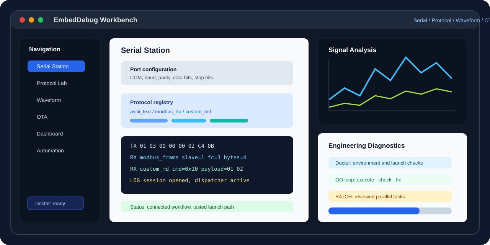

# EmbedDebug

> 面向嵌入式研发、硬件联调和测试现场的 Qt 桌面调试工作台。EmbedDebug 将串口工站、协议收发、日志留存、回放预览、测量观察、OTA、自动化和工程诊断收敛到一个可验证、可扩展、可交付的应用入口。




## 企业级精简快照（Push 前更新）

更新时间：`2026-06-15`  
阶段目标：`500/1000 -> 1000/1000`  
当前分数：`500/1000`（按每次门禁 `+1`）  
周期规则：每 2 次门禁通过 commit 形成 1 个 Push 周期，周期末更新本快照后方可 push。

### 快速状态（精简）

- **启动链路**：`EmbedDebug.bat` → `build/EmbedDebug.exe`
- **最小验收**：`cmake --build build -j 4` + 3~5 秒窗口主窗口可见
- **三轴**：E4-E5 / U2-U3 / D1-D2
- **证据入口**：本仓库约束链路、CMake、startup smoke
- **本周期新增**：命令面板失败分级提示（编码/未连接/写入）接入 `serialCommandFailedWithReason`，并在主工作区显示具体失败归类；新增“重试策略”配置（重试次数+间隔）并由 `SerialStationController::sendCommand` 落地执行重试与审计；`Ctrl+Enter`/`Ctrl+O`/`Ctrl+W` 快捷闭环接入同步补齐 `send.execute`

### 企业级架构快照（本轮）

- **入口层（L6）**：`EmbedDebug.bat` -> `main` -> `MainWindow`  
  - 只进行装配与路由，不承接串口/协议解析的业务逻辑；
  - 通过 `PanelManager` 与导航策略保持视图编排和上下文隔离。
- **能力域层（L5-L4）**：`SerialStation`/`Terminal`/`Automation` 按能力域分片；
  - 能力接口优先落在 `src/interfaces` 与 `src/shared`，跨域调用走接口契约；
  - 功能扩展通过模块化注册，而非主窗口硬编码。
- **执行层（L3-L1）**：`protocols` 仅承担帧语义与解析，`core` 做会话/收发分发，`services/workers` 承担持久化与异步任务；
  - Worker 仅通过 signal 下沉到 Controller，不直接变更 UI。
- **数据与交付层（L0）**：`src/utils/shared/services` 管理日志、会话持久化、导出和回放，保证复用与可观测性。

#### 架构闭环（可核验）

```text
MainWindow -> SendController -> SerialStationController
      -> SerialManager -> ISerialProtocol / ProtocolRegistry
      -> ProtocolParser / FrameDecoder
      -> Services/Workers -> Log/Snapshot/Export
```

#### 风险治理（本轮）

- **高优先级**：设备侧验收仍偏 D1，缺少替身/真实链路回放一体化证据，短期会影响对外“可用”口径；
- **中优先级**：串口关闭/重连失败分支仍需统一错误模型复用到 UI 提示；
- **已缓解**：主窗口与业务层分离、命令失败归因链路与快捷键入口闭环已经打通。

### 本周期收敛重点

- 约束与闭环文件同步：`docs/constraints/*.md`、`docs/serial_station_architecture.md`
- 下周期目标：把 `D2` 提升到 `D3`，补齐真实/虚拟链路闭环

### 企业级发布治理（本轮）

- **发布前闭环**：必须有构建、启动 smoke、三轴更新、证据引用四项齐备。
- **口径治理**：任何能力标记需带 `E/U/D`，并且必须可由源码、测试、文档或启动记录追溯。
- **风险处理**：`P0/P1/P2` 风险需给出责任人、缓解动作与截止时间。
- **一致性原则**：README、约束文档、任务 PRD/Specs 与代码行为在同一版本周期内保持一致。

## 关键决策：构建工具（Bazel 与 CMake）

### 结论先行

- 当前不建议默认切到 Bazel。对该仓库，优先保持 `CMake + Ninja` 更稳，收益确定性更高。
- Bazel 不是“天然更快”，通常需要先满足高复用场景（大量重复子图、跨语言依赖、增量编译模式稳定）才明显收益。

### 触发阈值（满足才可提交迁移 PRD）

1. `cmake --build build` 的典型增量构建持续超过 2 分钟，且连续 3 次以上。  
2. 连续增量改动中，重编译率持续高于 80%，且二次修改同一模块后可复建时间降幅持续不足 60%。  
3. 有明确收益目标（首轮目标：增量周期下降 ≥ 30%，并保持现有启动链路不变）。  
4. 迁移不影响 `EmbedDebug.bat` 的双击启动与 `build/EmbedDebug.exe` 约定产物。

不满足以上任一项，不作为默认迁移理由；先优化 CMake + Ninja（ccache/sccache、预编译、模块拆分）再复评。

### Push 前 README 规则（复核）

- push 前必须更新本精简快照（当前文件首屏）
- 保持“启动链路 + 最小验收 + 三轴 + 周期分数”四项始终可核验

## 项目定位

嵌入式调试现场常被拆散在串口助手、协议解析器、波形查看器、日志工具、脚本工具和临时诊断面板中。EmbedDebug 的目标是把这些链路整理成一个稳定的工程工作台，让固件、硬件和测试工程师能在同一个入口完成连接配置、命令发送、帧解析、日志留存、会话回放和问题复现。

当前仓库是持续演进的工程版本。项目以 PRD/Specs、分层架构约束、QTest 自动化、启动探针和评分追踪管理每轮迭代。README 只声明仓库内已有证据支撑的能力；未经过真实设备验证的能力不会包装成量产结论。

## 当前快照

| 项目 | 状态 |
|------|------|
| 应用名称 | `EmbedDebug` |
| 主开发分支 | `feat/embed-debug` |
| 启动入口 | `EmbedDebug.bat` |
| 串口工站直达 | `EmbedDebug.bat --station serial` |
| 档案启动 | `--profile <file.edserialprofile>`、`--last-profile`、`--profile-dir <dir>` |
| 技术栈 | C++17、Qt Widgets、CMake、Ninja、QTest |
| 构建目录 | 仅允许 `build/` |

## 能力成熟度

| 能力域 | 仓库证据 | 工程状态 | 用户路径 | 设备验证 |
|--------|----------|----------|----------|----------|
| Serial Station 串口工站 | `src/apps/serial_station/`、QTest、启动入口 | E5 | U4 | D1 |
| UART 配置链路 | 端口枚举、手动 COM、配置摘要、连接日志 | E4 | U3 | D1 |
| 协议收发与解析 | `ascii_text`、`modbus_rtu`、`custom_md`、`just_float` | E5 | U3 | D1 |
| 测量通道观察 | JustFloat measurement、通道摘要、最近帧趋势、轻量波形预览、CSV 导出服务 | E5 | U3 | D1 |
| 命令历史与配置档案 | 最近命令、`.edserialprofile`、最近/上次/默认目录 | E5 | U4 | D1 |
| 日志、导出、回放预览 | 结构化日志、导出服务、回放服务、UI 闭环 | E4/E5 | U3 | D1 |
| 终端、图表、OTA、BLE/CAN/MQTT/USB/RTT | 阶段性模块和集成代码 | E2-E4 | U1-U3 | D0-D1 |

状态口径：

```text
Engineering: E0 未开始 -> E5 可维护闭环
User path:   U0 不可见 -> U4 完整工作流
Device:      D0 未验证 -> D4 真实设备验证
```

## Serial Station

Serial Station 是当前最活跃的工作台方向，落点为 `src/apps/serial_station/`。它已经覆盖串口配置、协议选择、ASCII/HEX/协议模式发送、结构化日志、导出、回放预览、命令历史、配置档案、最近档案索引、默认档案目录、JustFloat 测量摘要、最近帧趋势、轻量波形预览和测量 CSV 导出服务。

常用入口：

```powershell
.\EmbedDebug.bat --station serial
.\EmbedDebug.bat --station serial --profile .\profiles\line-a.edserialprofile
.\EmbedDebug.bat --last-profile
.\EmbedDebug.bat --station serial --profile-dir .\profiles\line-a
```

协议支持：

| 协议 | 用途 |
|------|------|
| `ascii_text` | 文本终端、AT 类命令 |
| `modbus_rtu` | 基础 Modbus RTU 主站请求与响应解析 |
| `custom_md` | 自定义 MCU 调试帧 |
| `just_float` | 参考 VOFA+ JustFloat 数据路径，解析小端 IEEE754 float 数组 + `00 00 80 7F` 帧尾，并汇总到测量摘要、最近帧趋势和轻量波形预览 |

JustFloat 当前已完成协议注册、流式解析、工作台选择、测量摘要、最近帧趋势、轻量波形预览和测量 CSV 服务；下一步重点是接入完整波形工作区，并通过虚拟串口或真实硬件样本提升设备验证等级。

## 架构边界

```text
ui/ -> SerialStationController -> core/ + protocols/ + services/
workers/ -> core/
core/ -> ISerialProtocol + SerialProtocolRegistry
protocols/<name>/ -> protocol interface + shared/utils only
services/ -> JSON、日志、导出、回放、档案、测量摘要和趋势缓冲
```

## 企业级架构快照（本轮）

- **入口层（L6）**：`EmbedDebug.bat` 及 `main` -> `MainWindow`，仅编排导航与装配，不承载业务解析。  
- **控制层（L5）**：`MainWindow/Controller/Manager` 负责会话、连接、发送与设置编排，业务动作下沉到能力域控制器。  
- **能力域层（L4-L2）**：串口、协议、数据、日志、展示等能力按既有目录解耦，快捷键通过 `ShortcutManager` 做上下文分发（`Global`/`Terminal`/`SendArea`）。  
- **共享服务层（L1-L0）**：`Utils/Shared/Interfaces` 提供状态、事件、持久化与协议注册的横切能力，防止 UI 直接依赖底层协议实现。  
- **闭环路径（真实可验）**：  
- `Ctrl+Enter` → `MainWindow::executeSendShortcut` → `SendController::executeSend` → `SendController::onSendData`  
  - `Ctrl+O` → `openProjectForShortcut` → `ProjectManager::loadProject`  
  - `Ctrl+W` → `closeTabForShortcut`（工程关闭降级实现）  
  - `Ctrl+P` 命令面板新增 `send.execute`，形成“命令面板-快捷键-业务动作”一致化入口  
  - `SerialCommandPanel::emitSendRequested` → `SerialStationController::sendCommand`（携带 `retryCount/retryDelayMs`） → `SerialManager::send`（分块重试）→ `SerialStationController` 失败/成功日志与 `SerialCommandFailed` 重试审计（含配置）→ `SerialStationWindow` → `SerialCommandPanel::notifyCommandFailed(reason, message)`  

**重试闭环审计证据**：`src/apps/serial_station/ui/SerialCommandPanel.cpp/.h`（界面参数采集）、`src/apps/serial_station/SerialStationController.cpp`（重试循环与失败原因）、`tests/serial_station/test_serial_command_panel.cpp`（信号携带默认与透传值）。

证据路径：`src/core/mainwindow/MainWindowInit.cpp`、`src/core/mainwindow/MainWindowInitShortcuts.cpp`、`src/core/mainwindow/MainWindowSetupUI.cpp`、`src/core/send/SendController.h`、`src/core/send/SendControllerSend.cpp`。

核心规则：

| 规则 | 要求 |
|------|------|
| 不经 PRD 不写新功能 | 新行为必须先有 PRD/Specs |
| 只允许一个构建目录 | 固定使用 `build/` |
| 不提交死源码 | 新增 `.h/.cpp` 必须加入 CMake |
| 壳层不写业务逻辑 | `MainWindow` 和 `PanelManager` 只装配和导航 |
| 公共能力优先复用 | CRC、HEX、Settings、日志、导出、RingBuffer 等不重复造 |
| 严格对外文档 | README 企业级快照与代码行为同步更新 |
| 先验证再声明 | 构建、测试、启动探针和状态记录支撑每次提交 |

## 快速开始

首次在已配置的 Windows 工作站启动：

```powershell
.\tools\bootstrap_env.bat
.\EmbedDebug.bat
```

手动配置和构建：

```powershell
cmake -G Ninja -B build -DCMAKE_PREFIX_PATH=C:/msys64/mingw64
cmake --build build --target EmbedDebug --parallel 4
.\EmbedDebug.bat
```

常用工具：

```powershell
uv run start-embeddebug
uv run package-embeddebug --skip-build --clean
uv run package-embeddebug --skip-build --clean --zip
uv run verify-package-embeddebug
uv run test-embeddebug-tools
```

## 本地验证

核心验证：

```powershell
cmake -G Ninja -B build -DCMAKE_PREFIX_PATH=C:/msys64/mingw64
cmake --build build --target EmbedDebug --parallel 4
.\EmbedDebug.bat --station serial
```

Serial Station 聚焦验证：

```powershell
cmake --build build --target test_startup_options test_serial_measurement_service test_serial_measurement_export_service test_serial_measurement_waveform_widget test_serial_measurement_panel test_serial_station_controller test_serial_station_workbench --parallel 4
.\build\tests\test_startup_options.exe
.\build\tests\test_serial_measurement_service.exe
.\build\tests\test_serial_measurement_export_service.exe
.\build\tests\test_serial_measurement_waveform_widget.exe
.\build\tests\test_serial_measurement_panel.exe
.\build\tests\test_serial_station_controller.exe
.\build\tests\test_serial_station_workbench.exe
```

协议验证：

```powershell
cmake --build build --target test_ascii_text_protocol test_modbus_rtu_protocol test_custom_md_protocol test_just_float_protocol test_serial_protocol_registry --parallel 4
ctest --test-dir build -R "AsciiTextProtocol|ModbusRtuProtocol|CustomMdProtocol|JustFloatProtocol|SerialProtocolRegistry" --output-on-failure
```

## 仓库结构

```text
GS_Tool/
|-- src/
|   |-- apps/serial_station/   # Serial Station 串口工站
|   |-- core/                  # 应用协调和共享 UI 运行时
|   |-- connection/            # 连接实现与工厂
|   |-- protocol/              # 协议引擎、桥接、Schema
|   |-- terminal/ chart/       # 终端、波形和数据呈现
|   |-- ota/ automation/       # OTA 与自动化
|   |-- utils/ shared/         # 复用工具和轻量类型
|   `-- interfaces/            # 纯接口
|-- tests/                     # QTest 目标
|-- resources/                 # 主题、图标、翻译和资源
|-- docs/                      # 约束、PRD、Specs、评审、追踪
|-- tools/                     # bootstrap、打包、审计和启动工具
|-- cmake/EmbedDebugSources.cmake
|-- CMakeLists.txt
|-- EmbedDebug.bat
`-- README.md
```

## 路线图

| 优先级 | 方向 | 目标 |
|--------|------|------|
| P0 | Serial Station 连接策略 | 补可控连接、异常恢复和现场可诊断反馈 |
| P0 | VOFA+/OmniProbe 式数据观察 | JustFloat measurement 摘要、最近帧趋势和轻量波形预览已落地，下一步接入完整波形工作区和虚拟串口样本验证 |
| P0 | 虚拟串口或硬件回环验证 | 将设备证据从 D1 推向更接近真实现场 |
| P1 | QSS token 与 UI 一致性 | 降低主题漂移，统一控件层级 |
| P1 | 发布包体验 | 强化 `dist/` 校验、随包文档和启动路径 |

## 贡献方式

欢迎提交 Issue 和 Pull Request。项目鼓励大家把真实设备样本、协议适配、UI 体验和工程化修复以 PR 形式贡献回来，尤其是以下方向：

- 串口协议适配、真实设备样本、虚拟串口验证脚本。
- VOFA+/OmniProbe 式波形观察、测量面板和数据回放体验。
- Qt Widgets UI 一致性、QSS 主题、图标和可访问性改进。
- Windows 构建、打包、启动和交付链路优化。

提交 PR 前请先阅读 [CLAUDE.md](CLAUDE.md) 与 `docs/constraints/` 下的相关约束文档。新增功能需要配套 PRD/Specs、CMake 注册和可运行验证；涉及真实设备的结论请写明设备、端口、样本和复现步骤。

项目联系邮箱：1264206065@qq.com

## License

MIT License.
